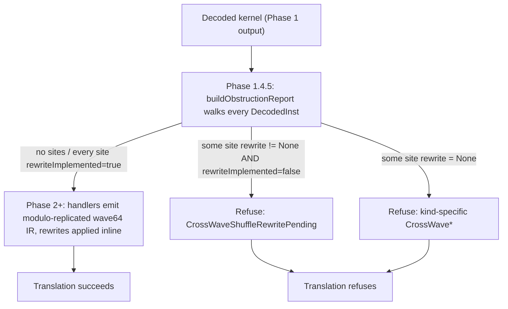

# Wave-Size Translation — EXEC Divergence and Cross-Wave Lowering

> **Status:** implemented end-to-end for wave32 → wave64 (gfx1250 →
> gfx942 / gfx950). Intra-block EXEC divergence is modelled via SIMT
> Predicated Execution (SPE). The wave-size gap is bridged via
> modulo-replication, guarded by a syntactic wave-size-obliviousness
> classifier (Phase 1.4.5) that runs a 3-outcome decision procedure
> (emit / rewrite / refuse) over four obstruction classes (C1–C4).
> Every cross-lane primitive the GPT-OSS corpus exercises has a landed
> rewrite; kernels the classifier cannot discharge refuse loudly at
> raise time.
>
> **Scope:** gfx1250 (RDNA4, wave32) → gfx942 / gfx950 (CDNA3 / CDNA4,
> wave64). The same-family case (gfx1250 → gfx1250 / gfx1251) bypasses
> the projection machinery via target-capability dispatch. The
> framework generalises to any future `(source, target)` ISA pair whose
> wave sizes differ.

---

## 1. Problem in one paragraph

The source binary and target ISA disagree on what a wavefront is.
gfx1250 executes 32 lanes in lockstep; gfx942 / gfx950 execute 64. The
binary bakes the 32-lane assumption into three observable places: the
width of `EXEC`, the semantics of every cross-lane primitive, and the
bit patterns of lane-id / workgroup-rank math. On top of that, the
source uses **intra-basic-block EXEC manipulation** (`v_cmpx`,
`s_and_saveexec`, SGPR arithmetic on EXEC) to gate lane-observable side
effects — stores, atomics, cross-lane reads — which the pre-SPE raiser
modelled as a scalar alloca and silently dropped. Translation must
simultaneously (a) re-emit every EXEC-gated side effect as a real
divergent LLVM-IR construct the AMDGPU backend understands, and (b)
project 32-lane source semantics onto 64 physical target lanes without
diverging from gfx1250 observable behaviour. Refusing wave32 kernels
is not an option (GPT-OSS is wave32-only); a silent-miscompile
fallback is out of bounds (`user_rules`: no fallback solutions, no
hidden errors).

## 2. Design space

Two independent questions: **how to represent EXEC-gated side effects
in SIMT LLVM IR**, and **how to project 32-lane source semantics onto
a 64-lane target wave**. The Status block names what we picked for
each; this section is the alternatives and what they cost.

### 2.1 EXEC-gated side effects — the archetypes

Hard constraint: the translator emits LLVM IR that the stock AMDGPU
SIMT backend consumes — giving that up means forking LLVM. Inside
SIMT IR one "thread" is one wave lane; per-lane state is thread-local
SSA / allocas; wave-level state is uniform; straight-line IR has no
"dormant" state. EXEC masking of side effects is therefore only
expressible via divergent control flow or masked intrinsics carrying
an `i1` derived from the lane's EXEC bit.

The archetypes surveyed in issue #11:

| Archetype | What it costs |
|---|---|
| Detect wave-size mismatch and abort the raise | Refuses 100% of the wave32 corpus — not a translation strategy. |
| `<waveSize × T>` vector-of-lanes IR | The AMDGPU backend reads each vector element as one value *per abstract thread*, so each lane does `waveSize×` the original work. |
| Scalar-alloca per-lane mask threaded by hand | A single scalar alloca cannot name per-lane divergence — only expresses "uniform-or-nothing." |
| Opaque target-handoff intrinsics (`@hsa.hotswap.masked_store` etc.) | Combinatorial per-(instruction, wave-size) lowering; every new target ISA re-opens the set. |
| Structural re-lifting (decompile to a CFG of structured predicates) | Only works on structured control flow; Triton / AITER output does not guarantee it. |
| Wrap every EXEC-gated instruction in a construct divergent on the lane's EXEC bit | Fits SIMT IR, preserves "any kernel." Two equivalent encodings (`br i1` diamond, masked intrinsic carrying the same `i1`) differ only in shape. |

The last row is **SPE**; §5.1 specifies the diamond form.

### 2.2 Wave-size projection — the ladder

"What do the other 32 lanes do?" Prior art (LLVM's `SIConvertWaveSize`
whitelist, POCL's SIMD-to-scalar, Ocelot's PTX-to-x86 thread-loop, the
hetGPU / DynamoRIO wave-width binary translators) converges on:

| Projection | Throughput | Correctness domain | What it costs |
|---|---|---|---|
| Half-wave masking (legacy transpiler) | ~50% | `blockDim.x ≤ 32` only. | Silently drops the upper half of every `blockDim.x > 32` workgroup — 100% of the GPT-OSS and AITER corpora. Keeping it as a fallback hands callers a second wrong answer when the preferred projection refuses. |
| Full-wave packing (two source waves per target wave) | 100% | None. | Every wave-level op (EXEC arithmetic, VCC, ballots, cross-lane primitives) breaks — packed waves share hardware EXEC but expect disjoint ones. |
| Thread-loop transformation | ~50% | Lane-position-dependent EXEC kernels. | Class 2 obstructions (§6) persist — a thread loop cannot re-express `v_permlane64` as something wave32 observes. |
| Scalarisation | 1 / W_s | Near-total. | ~32× slowdown on wave32; last-resort rung only. |
| Wave-native projection **(default for wave32 → wave64 since 2026-04-21)** | 100% | Wave-size-oblivious kernels AND `num_warps > 1` source kernels AND matrix kernels dependent on Wave64-collective correctness (§5.6.1). | `@llvm.amdgcn.init_whole_wave` at kernel entry forces hardware EXEC = -1 kernel-wide; the original per-lane active mask is saved to the (widened) EXEC alloca. Each target lane has its own modeled-EXEC bit — lanes 0..31 of target wave 0 model source wave 0, lanes 32..63 model source wave 1 (each with its own EXEC register, NOT replicas). Costs a per-kernel `init_whole_wave` prologue and a per-side-effect SPE diamond. Correct on the superset of the modulo-replication domain: everything modulo-replication gets right, plus `num_warps > 1` kernels where source EXEC registers are independent per wave (documented at hotswap/docs/modrep-predicate-chain.md §6). |
| Modulo-replication | 100% | Narrow subset of wave-size-oblivious kernels where every source wave replicates cleanly onto the target wave (G1-passing, no `num_warps > 1` state per §5.6.1). | The target wave runs as two wave32 replicas sharing the source EXEC mask; the source-EXEC bit for target lane `i` is selected at `lane_id MOD W_s`. Correct **iff** the source is wave-size-oblivious AND a single source EXEC replicates faithfully across both replicas — falsifiable per kernel by §7. Retained as an opt-in (`--disable-wave-native` / `enableWaveNative=false`) for pointwise / independent-half kernels AND for lit fixtures that pin MODREP-shape IR invariants (the C5 predicate-chain classifier only refuses under MODREP). |

The first four rows each miscompile a named construct or pay a
~wave-width throughput penalty. Wave-native is the post-graduation
default and what survives for `num_warps > 1` and matrix kernels;
modulo-replication is the pre-graduation default and remains
valid on the narrower class where single-replica EXEC semantics are
faithful. §6 defines *wave-size-obliviousness* precisely and §7
discharges it statically via a three-outcome procedure (emit /
rewrite / refuse). Thread-loop and scalarisation remain higher-obligation
rungs for kernels that reach outcome (c) under either projection.
`ThreadLoopProjection` now exists as an explicit, conservative projection
surface in `transpiler/wave_projection.{hpp,cpp}` and is auto-selected only
after the post-raise `writelane/readlane-post-raise-safety-net` proves the
narrow SGPR-forced class: cross-widening, integer wave-size ratio, and a
writelane/readlane result whose SSA use-chain reaches an explicit
`llvm.amdgcn.readfirstlane` sink. That route lowers `readlane`, `writelane`,
and explicit `readfirstlane` as source-wave-scoped operations at the
projection boundary; it does not widen the rewrite allow-list. Scalarisation
still has no skeleton yet.

## 3. Source model — gfx1250 wave32

Three load-bearing behaviours the source inherits from wave32:

1. **EXEC is 32 bits.** Written via `S_MOV_B32 EXEC_LO`,
   `S_AND_B32 EXEC_LO`, `V_CMPX`,
   `S_{AND,OR,XOR,ANDN2,ORN2}_SAVEEXEC_B32`, and scalar arithmetic on
   `EXEC_LO`. The high half of the target's physical EXEC does not
   exist in the source.
2. **Cross-lane primitives are wave32-relative.** `V_PERMLANE16_B32`
   fans out across lanes 0..15 and 16..31; `V_PERMLANE16_SWAP_B32`
   swaps those halves; `DS_BPERMUTE_B32` takes a byte-address selector
   in `[0, 128)` whose valid range is wave32-bounded; `DS_SWIZZLE_B32`
   uses wave32-typed patterns. `V_PERMLANE64_B32` does not exist.
3. **Lane-id math assumes wave32.** `V_MBCNT_LO_U32_B32` alone
   reconstructs the full lane id; `V_MBCNT_HI_U32_B32` is absent or
   constant-zero. `mbcnt_lo(...)` produces values in `[0, 32)`.

These are the semantic anchors every obstruction class in §6 violates
under naive widening.

## 4. Target model — gfx942 / gfx950 wave64

Three symmetric behaviours the target imposes:

1. **EXEC is 64 bits.** Materialised through `EXEC_LO` / `EXEC_HI`;
   32-bit partial writes are first-class and must be honoured
   (commit `915c5a6c45`). `V_CMPX`, `S_AND_SAVEEXEC_B64`, and the
   `*_SAVEEXEC_B64` family write the full 64-bit register.
2. **Not every wave32 cross-lane primitive has a native analogue.**
   `llvm.amdgcn.permlane16` / `permlanex16` / `permlane16.swap` fail
   ISel on CDNA. `ds_bpermute`, DPP modifiers, and `ds_swizzle` are
   available on gfx8+ and usable as rewrite building blocks. These
   absences shape §7's rewrite table.
3. **`V_MBCNT_HI_U32_B32` is real.** A direct modulo-replication of a
   wave32 kernel that builds lane id via `mbcnt_lo(...) + mbcnt_hi(...)`
   observes values in `[0, 64)` instead of `[0, 32)` — a Class 1
   obstruction.

## 5. Translation design

### 5.0 Target-capability dispatch (same-wave fast path)

Every handler branches on `isa.waveSize == targetIsa.waveSize`; the
match case is the fast path. On match, the SPE diamond emits the same
`lshr`/`and`/`icmp` chain, but the `and lane_idx, (execBits - 1)` MOD
fold collapses to the identity and LLVM opts erase it along with the
diamond in uniform regions; cross-lane primitives emit their native
intrinsics directly; the Phase 1.4.5 classifier short-circuits
(`buildObstructionReport` returns empty when source and target wave
sizes match). On mismatch, the classifier runs and dispatches per §7.

Source-wave width comes from the disassembled ISA; target width from
`ISAProfile` via `MCSubtargetInfo::hasFeature(FeatureWavefrontSize32)`
— both sides track LLVM's TableGen directly.

### 5.1 SPE diamond: per-lane EXEC-gated side effects

Every decoded instruction whose hardware semantics is "commit only on
lanes where the EXEC bit is 1" is wrapped in:

```text
%exec             = load <execTy>, ptr %exec_alloca
%lane_lo          = call i32 @llvm.amdgcn.mbcnt.lo(i32 -1, i32 0)
%lane_id          = call i32 @llvm.amdgcn.mbcnt.hi(i32 -1, i32 %lane_lo)   ; wave64 only
%spe_lane_idx     = zext i32 %lane_id to <execTy>
%spe_lane_mod     = and  <execTy> %spe_lane_idx, (execBits - 1)
%spe_exec_at_lane = lshr <execTy> %exec, %spe_lane_mod
%spe_exec_bit     = and  <execTy> %spe_exec_at_lane, 1
%spe_lane_active  = icmp ne <execTy> %spe_exec_bit, 0
br i1 %spe_lane_active, label %spe_do, label %spe_skip
spe_do:
  <side-effectful IR: store / atomic / divergent VGPR write>
  br label %spe_skip
spe_skip:
  ...
```

`%spe_lane_active` is data-dependent on `workitem.id.x`, so LLVM's
divergence analysis marks the branch divergent and the AMDGPU backend
re-materialises `v_cmpx` around `spe_do`. Uniform regions (EXEC
provably `-1`) fold `%spe_lane_active` to `true` and the branch
disappears, matching the pre-SPE baseline.

Shift-then-mask (rather than `shl 1, lane; and exec, mask`) is
load-bearing for cross-wave: the `and %lane_idx, (execBits - 1)` MOD
fold clamps the shift into `[0, execBits)` at source width,
sidestepping LLVM's `lshr iN, M` poison rule when a target lane id
exceeds the source wave width. On same-wave the mask folds to identity
and LLVM erases the `and`.

**Emitters** (all in `wave_projection.cpp` / `raise_context.cpp`):
`ModuloReplicationProjection::emitLaneActiveBit` emits the chain
against `regs.loadExec(B)`; `RaiseContext::emitLaneActiveBit` caches
the `i1` per BB, invalidated on every source-instr boundary and every
`storeExec` via the `onExecWritten` hook installed once at context
construction — centralising correctness so low-level EXEC writers
cannot forget to invalidate. `RaiseContext::emitUnderExec(body)`
splits the BB into `spe_do` / `spe_skip`, runs `body` in `spe_do`,
re-anchors at `spe_skip`; linear expansion keeps the cached `i1`
dominating every downstream diamond.

**Write-routing contract** (`RaiseContext::writeReg{32,64,Vec}`,
`storeVGPR{32,64}`, `storeAGPR32`):

- **Wrapped** in `emitUnderExec`: every VGPR / AGPR write and every
  side-effectful memory op routed through the context helpers — the
  conditional store is what gives mem2reg something to phi across, so
  inactive lanes don't observe the active-lane value.
- **Not wrapped**: SGPR / VCC / SCC / M0 / TTMP writes (wave-level);
  EXEC writes (route through `regs.storeExec`); `writeRegExecWidth`
  (wave-level commits whose value is computed cross-lane — VCC
  ballots, saveexec results).
- **Cross-lane primitives** (`ds_bpermute`, `readfirstlane`,
  `readlane`, `writelane`, `amdgcn.update.dpp`, `ds_swizzle`) emit
  their convergent call *outside* `emitUnderExec` so every hardware
  lane participates, then the VGPR store is wrapped by normal
  `writeReg32`.

Handler coverage of the contract: `handle_flat` / `handle_mubuf` /
`handle_ds` wrap stores and atomics; `handle_mfma` / `handle_valu`
wrap VGPR / AGPR writes; `handle_vopd` routes through `storeVGPR32`;
`handle_valu_vcmp` routes `V_CMPX` through `regs.storeExec`;
`handle_valu_cross_lane` emits convergent intrinsics unwrapped and
hands the result to a wrapping VGPR store.

**SSA-name contract** (`spe_*`, `cmpx_exec`, `new_exec`, `and64`,
`vcmp`, `vlshl`): FileCheck anchors for `lit_tests/allow_list_audit/`,
`lit_tests/divergent_vgpr_ir/`, etc. Rename protocol (one patch):
update the emitter, update this list, update every failing lit
`CHECK` to the new name (no regex loosening), run
`ninja check-transpiler-lit`.

Core landing: `2873d140b0` (SPE diamond, `lane_active` cache,
`onExecWritten`, allow-list gate).

### 5.2 Wave-size projection: modulo-replication

On the cross-wave path the same `emitLaneActiveBit` computes the lane
id on the target and selects the source-EXEC bit at
`lane_id MOD source_wave_bits`. The target wave runs as two wave32
replicas sharing the source EXEC mask.

Picture (wave32 → wave64, R = 2); columns are the SSA values
`ModuloReplicationProjection::emitLaneActiveBit` emits, identical to
§5.1's IR block:

```text
target wave (one physical wave64 = 64 lanes):

  target lane id    :   0   1   2  ...  31 |  32  33  34  ...  63
  spe_lane_idx      :   0   1   2  ...  31 |  32  33  34  ...  63   (zext of mbcnt)
  spe_lane_mod      :   0   1   2  ...  31 |   0   1   2  ...  31   (& execBits-1, folds to identity on same-wave)
  spe_exec_at_lane  :  exec >> spe_lane_mod                         (same source exec both halves)
  spe_exec_bit      :  (exec >> spe_lane_mod) & 1
  spe_lane_active   :  spe_exec_bit != 0                            → enter spe_do
```

Target lane `i` commits iff bit `i mod W_s` of the source EXEC is set.
Every pointwise-lifts-to-pointwise kernel (the bulk of AITER / MoE /
vecadd) is correct under this because its EXEC writers are
lane-position-independent (bounds checks `lane < N` with uniform
`N ≥ target_wave_bits`).

Related landings: `915c5a6c45` (wave64 `EXEC_LO/HI` partial-write
fix), `0dfeb4652a` + `055c83cb3d` (cross-wave surface + modulo-
replication).

### 5.3 Cross-lane primitive rewrites

Modulo-replication preserves cross-lane primitive semantics only if
the primitive is itself lifted to an LLVM cross-lane intrinsic — a
same-lane "copy operand to dst" stub silently drops the remap. Every
SemOp below is either a landed rewrite here or a §7 refusal; no
third path.

Lifted SemOps (`V_PERMLANE32_SWAP_B32`, `V_PERMLANE64_B32`,
`DS_PERMUTE_B32` pending as P6.b are refused in §7):

| SemOp | Handling | Landing |
|---|---|---|
| `V_READFIRSTLANE_B32` | `llvm.amdgcn.readfirstlane.i32`; SGPR dest bypasses `emitUnderExec`. | pre-SPE |
| `V_READLANE_B32` / `V_WRITELANE_B32` | `llvm.amdgcn.readlane` / `writelane`. Never-written source VGPRs read as `undef` (hardware-undefined on those lanes). Static const operands outside `[0, W_s)` caught by §7's `OutOfRangeLaneOperand`. | pre-SPE |
| `V_MBCNT_LO_U32_B32` / `V_MBCNT_HI_U32_B32` | `llvm.amdgcn.mbcnt.{lo,hi}`. `mbcnt.hi` is a Class 1 obstruction, caught by §7. | pre-SPE |
| `DS_BPERMUTE_B32` (P1) | `llvm.amdgcn.ds.bpermute`. Selector assumed in `[0, source_wave)` → naturally half-independent on wave64. | `d9bfd99626` |
| `V_PERMLANE16_B32` / `V_PERMLANEX16_B32` (P2) | `ds_bpermute` emulation from decoded selector nibbles, `^ 0x10` for `permlanex16`. Only `op_sel:[1,0]` supported (`fi=0` / `bc=1` refuse). Target-independent — gfx942 lacks native ISel. | `4ff69403f0`, `01ca97e4aa` |
| `V_PERMLANE16_SWAP_B32` (P4) | Paired `ds_bpermute`, partner `lane_id XOR 16`. Bit-exactly verified against gfx942. | `0c3f526008`, `5b721e8c91`, `bccdccfbb2` |
| DPP modifiers (any base VOP) (P5) | Decode lifts `dppCtrl` / `dppRowMask` / `dppBankMask` / `dppBoundCtrl` into `DecodedInst` before opcode canonicalisation. `emitUpdateDpp` emits `llvm.amdgcn.update.dpp.{i32,i64}`; `OpResolver::src*` routes src0 through `wrapDppIfNeeded`. DPP8 refuses (pending P5.b). | `2dc9aa927e`, `75cf67cc18` |
| `DS_SWIZZLE_B32` (P6) | Imm extracted at decode; accepts QUAD_PERM, BITMASK_PERM, valid FFT_MODE / ROTATE_MODE per LLVM's `Swizzle::EncBits`. Reserved envelopes and reserved-bit imms refuse. | `81e070c32b`, `4d4b2deacd`, `0e770da0dd`, `5cd9b6d210`, `af5c8ba4a4`, `2c02750f66` |

Cross-lane closure on GPT-OSS is complete as of P4 (`0c3f526008`);
residual failures after P1 / P2 / P4 / P5 / P6 are orthogonal Phase 5
handler gaps (§9).

**VCC is bi-modal** — per-lane `i1` for `v_cndmask`, wave-level `iN`
for SALU. Reads into wave-level consumers route through
`readVCCAsWaveMask` → `llvm.amdgcn.ballot.iN` at full EXEC (caller
invariant); wave-level writes truncate via `extractLaneBitFromWaveMask`
before storing to the `i1` alloca. Commit `b34d8e9bda`.

### 5.4 EXEC-writer detection and the SPE allow-list gate

SPE is sound only if every EXEC mutation routes through
`regs.storeExec` — the single entry point that triggers `lane_active`
invalidation. Detection and allow-list both track LLVM's target
description so neither can drift from a hand-rolled mnemonic list.

**Detector** (`instructionWritesEXEC`): implicit-def walk over
`MCInstrDesc::implicit_defs()` catches the `*_SAVEEXEC` family and
`V_CMPX` (flagged by `DecodedInst::defsEXEC`); explicit-operand walk
over `MCInstrDesc::getNumDefs()` catches `S_MOV_B64 EXEC, sN` and
`S_AND_B64 EXEC, EXEC, sN` that `implicit_defs()` alone misses.

**Allow-list**: per-SemOp attribute
`SemOpAttrs::routesExecThroughStoreExec` (`sem_op_attrs.{hpp,cpp}`),
declared `true` in each handler's `get*Attrs()` registration after
auditing that every EXEC mutation in that handler routes through
`regs.storeExec`. Default is `false` — adding a new EXEC-writing
SemOp without a deliberate attribute fails by construction. Audit
reasoning lives next to the registration.

**Gates** (both fail loud):

- **G3 — startup.** `verifyExecAttrCoverage` sweeps every MC opcode
  whose `implicit_defs()` contains EXEC and fails raiser init if any
  mapped SemOp is missing the attribute.
- **G2 — per kernel.** Phase 1.5 in `raiser.cpp` walks every decoded
  instr, calls `instructionWritesEXEC`, and aborts with
  `RaiseFailure::speUnsafeExecWriter` on a `false` attribute —
  catching explicit-operand writes that G3 cannot predict.

### 5.5 HWREG policy

`s_getreg_b32` / `s_setreg_b32` / `s_setreg_imm32_b32` address a small
fixed space. Blanket no-op drops `FLAT_SCR` / `XNACK_MASK` silently;
blanket abort refuses every benign `s_setreg MODE` prologue. The
policy is therefore a direction-aware per-id classifier
(`handle_sopk.cpp::classifyHwreg(id)`):

| HWREG id(s) | Read | Write |
|---|---|---|
| `FLAT_SCR_LO/HI`, `MEM_BASES`, `XNACK_MASK` | `Abort` | `Abort` |
| `MODE` | `Zero` | `WarnDrop` |
| `TBA_LO/HI`, `TMA_LO/HI` (trap handler) | `Zero` | `Abort` |
| `STATUS`, `TRAPSTS`, `HW_ID[_12]`, `GPR_ALLOC`, `LDS_ALLOC`, `IB_STS[_2]`, `POPS_PACKER`, `SCHED_MODE`, `PERF_SNAPSHOT_DATA_gfx11`, `SHADER_CYCLES[_HI]`, `DVGPR_ALLOC_LO/HI` | `Zero` | `Drop` |
| *unknown id* | `Abort` | `Abort` |

`Read = Zero` materialises `i32 0`. `Write = Drop` no-ops;
`Write = WarnDrop` emits `transpiler: WARNING:` to stderr and drops;
`Write = Abort` refuses. Unknown ids fail closed — adding a row is
deliberate. `WarnDrop` on `MODE` (rather than `Abort`) preserves the
green-tests contract on prologues that set rounding mode but whose FP
is mode-insensitive, while flagging every unproven kernel.

### 5.6 EXEC / VCC / SCC / M0 initialisation

`AllocaRegFile::init` seeds condition-carrying allocas deterministically
so any read-before-write produces `0` / `false`, never `undef` /
`poison`:

- `exec`: projection-chosen (§5.6.1). `ModuloReplicationProjection::emitInitialExec`
  returns `-1`; `WaveNativeProjection::emitInitialExec` emits
  `@llvm.amdgcn.init_whole_wave` and seeds the alloca with the ballot
  of its `i1` return value.
- `vcc = false` (i1 0), `scc = false` (i1 0), `m0 = 0`.

`flat_scr[lo/hi]` and `ttmp[i]` are allocated but intentionally
uninitialised: the HWREG gate aborts any read on their companion
registers before the alloca can be read, and `ttmp` is only touched by
SMEM kernarg loads that always write first. Break either property,
add the zero store here.

`exec = -1` makes `emitLaneActiveBit` fold to `true` in uniform regions,
collapsing the `emitUnderExec` diamond to straight-line IR.

### 5.6.1 Hardware vs modeled EXEC under cross-widening

The wave-native projection decouples the *hardware* EXEC the gfx942 /
gfx950 wavefront applies from the *modeled* EXEC the `emitUnderExec`
diamond reads through the alloca. Three independent requirements
force this:

1. **SPE correctness on partial-wave launches.** A wave32 kernel
   launched with `blockDim.x == 32` runs as one gfx942 wavefront with
   hardware EXEC = `0x0000_0000_FFFF_FFFF` at entry. Modeled EXEC (the
   alloca `emitLaneActiveBit` reads) must be the author's abstract
   wave32 EXEC — `-1` at entry, independent of the target launch shape.
2. **Wave64-collective correctness.** The WMMA → MFMA lowering
   (`wmma_lowering.cpp`) and every convergent cross-lane primitive
   issues a single Wave64 intrinsic that reads all 64 lanes regardless
   of EXEC but writes each per-lane VGPR only where EXEC = 1. Under
   partial-wave hardware EXEC, lanes 32-63 skip the write; downstream
   readers (the collect-stage `ds_bpermute`) see undefined data and
   the WMMA's upper half miscompiles. The collective needs hardware
   EXEC = -1 across redistribute → MFMA → collect.
3. **Register-allocator scalability.** `SIPreAllocateWWMRegs` needs a
   dedicated unused physical VGPR per virtual register in a
   `@llvm.amdgcn.strict.wwm` bracket, and WWM brackets walk the
   def-chain back — wrapping an MFMA output pulls its accumulator's
   `IMPLICIT_DEF` / `AV_MOV_B32_IMM_PSEUDO 0` initialisers in. A
   128×128 f16 matmul tile has ~200 such initialisers; near the
   gfx942 256-VGPR ceiling the allocator aborts with `physreg not
   found for WWM expression`. Shrinking the bracket doesn't help —
   the def-chain still pulls initialisers in transitively.

(2) needs hardware EXEC = -1 kernel-wide; (3) rules out `strict.wwm`
in register-heavy kernels. The solution: force hardware EXEC = -1 at
entry via `@llvm.amdgcn.init_whole_wave` and keep the Wave64 constraint
a kernel-wide ambient. (1) still holds because modeled EXEC stays at
source width and `emitUnderExec` gates every VGPR write, memory op,
LDS op, and atomic through `br i1 %lane_active`; the backend sets
hardware EXEC to the ballot of the per-lane predicate inside each
`spe_do` and restores to -1 after. Net: no inactive source lane
commits a side effect; between diamonds hardware EXEC is -1; no
IR-level WWM bracket exists, so regalloc is ordinary.

`init_whole_wave` (`IntrinsicsAMDGPU.td`) sets hardware EXEC = -1 for
the remainder of the function and returns an `i1` whose true-bits
form the original per-lane active mask.
`WaveNativeProjection::emitInitialExec` ballots that `i1` into a
wave-width value and seeds the `exec` alloca, so modeled EXEC matches
the source author's wave32 view.

Modulo-replication does not need `init_whole_wave`: its EXEC alloca
is source-width, cross-lane primitives are rewritten to wave32-
equivalent constructs (§5.3), and the only Wave64-collective is
SPE's internal ballot in `extractLaneBitFromWaveMask`, which treats
the upper half as an independent replica.
`ModuloReplicationProjection::emitInitialExec` returns the default
all-ones. This independence is MODREP's strength on pointwise /
independent-half kernels and its fundamental limitation on
`num_warps > 1` kernels: if the source's two waves carry distinct
EXEC registers (e.g. a warp-0 store-gated region that warp-1
skips), MODREP's "replicas of source wave 0" model conflates them.
Wave-native's per-lane modeled EXEC — derived from the original
hardware mask captured by `init_whole_wave` — preserves the
per-source-wave distinction and correctly projects each source wave
onto its own target-wavefront half.

Post-graduation (2026-04-21), the default is `WaveNativeProjection`
for wave32 → wave64 cross-widening; `ModuloReplicationProjection`
is the fallback selected by `--disable-wave-native` or
`enableWaveNative=false`. See `hotswap/docs/modrep-predicate-chain.md`
§6 "Picked: WaveNative as default" for the empirical evidence
(the C5 examples are loud-refused under MODREP and match under the
default WaveNative evidence, including `canary_bpermute_scan_fp32`,
`swiglu_fp32`, `rmsnorm_fp32`, and `corpus_layernorm_fp32`; no
lit/ctest/BatchRaise regressions) and
`raiser.hpp`'s `enableWaveNative` parameter docstring for
the programmatic toggle.

Hook: `WaveProjection::emitInitialExec` (`wave_projection.{hpp,cpp}`);
`AllocaRegFile::init` calls it once per kernel. Supersedes the prior
per-MFMA-output `strict.wwm` strategy; `wmma_lowering.cpp`'s file
header cross-references this section.

### 5.6.2 wave_id lift — Class 1 rescue for ttmp8[29:25] reads

gfx12+ command processors materialise `wave_id_in_workgroup` in
`ttmp8[29:25]` for every launched wavefront, and the HIP front-end
emits the canonical read shape

```asm
    s_bfe_u32 sDST, ttmp8, 0x50019    # (offset=25, width=5)
```

anywhere the source uses `__builtin_amdgcn_mbcnt_hi` or inline
`wave_id` arithmetic for per-wave tile assignment (Tensile /
rocBLAS / AITER matmul, Triton persistent kernels). Under same-
wave translation this is boring: one wave's per-lane value is
uniform, and the transpiler's SGPR alloca path carries it
verbatim. Under cross-widening (`WaveNativeProjection`, wave32 →
wave64) the shape is a **Class 1 leak**: target lane `L`'s
authoritative wave_id is `(L / W_s) mod max_waves_per_wg`, which
differs between lanes 0..W_s-1 and W_s..2*W_s-1 within the same
target wave.

The raiser's phase-4 entry seeds the `ttmp8` alloca with the
correct per-lane expression
(`(workitem.id.x >> log2(W_s)) << 25`, see `raiser.cpp`). At the
LLVM-IR level that is divergent, and `mem2reg + InstCombine` fold
the BFE round-trip back to `workitem.id.x >> log2(W_s) & 0x1F`.
**But** the formally-scalar `s_bfe_u32` shape — SGPR-class source
(`ttmp8`) feeding an SGPR-class destination (`sDST`) — triggers
an implicit `readfirstlane` in the backend's divergence /
scalarisation pipeline: every downstream SGPR consumer sees a
single lane-0 value, so all 64 target lanes read `wave_id = 0`
and matmul tile-assignment collapses to a checkerboard (both
source-wave halves write onto the same tile).

Rescue: `handle_sop2.cpp::handleSOP2` special-cases the exact
`S_BFE_U32 (ttmp8, 0x50019)` operand tuple and emits the
architectural expression directly:

```llvm
    %tid  = call i32 @llvm.amdgcn.workitem.id.x()
    %wave = lshr i32 %tid, <log2(W_s)>       ; 5 for wave32 source
    %wid  = and  i32 %wave, 31               ; width=5 mask from 0x50019
    store i32 %wid, i32* %sgpr[N]
```

The `@llvm.amdgcn.workitem.id.x` leaf is permanently marked
divergent by the AMDGPU divergence analysis, so the VGPR the
backend picks for `%wid` is a genuine per-lane value; downstream
consumers of `sDST` see a divergent VGPR through the alloca and
tile-offset arithmetic stays correct across cross-widening.

Scope: deliberately narrow. The lift fires **only** for the exact
`(ttmp8, 0x50019)` shape. Any other ttmp8 source read (non-
canonical BFE immediates, `s_and_b32` / `s_lshr_b32` on ttmp8,
`s_load_dword` using ttmp8 as a 64-bit base pointer, trap-handler
prologues) still trips the `TtmpWaveIdLeak` classifier and
refuses — the raiser's init models only the `[29:25] = wave_id`
field, so any other bit pattern would silently miscompile. The
gating helper is
`wave_size_obstruction.cpp::isCanonicalWaveIdBfe`, co-located with
`readsTtmp8Source` for the symmetric rescue / refuse decision.

Hook: `handle_sop2.cpp::handleSOP2` under `SemOp::S_BFE_U32`;
`wave_size_obstruction.cpp::isCanonicalWaveIdBfe` gates the
classifier out of the lifted shape. Regression fence:
`lit_tests/c1_ttmp_wave_id_lift` asserts the three-instruction IR
shape (`workitem.id.x` → `lshr 5` → `and 31`) survives the raise,
and the matmul gpu-level suite (`GPU regression tests`,
`Gfx1250Gpu.Matmul{64,128}x*`) asserts end-to-end numerical
correctness across the cross-wave boundary.

The rescue is correct in isolation but insufficient when the lifted
VGPR value feeds a cross-lane primitive's scalar source operand in
the presence of WMMA — see §5.6.3 below for the post-mem2reg rewrite
that unblocks that shape, and the `WaveIdLiftScalarized` row in §7
for the three-outcome decision the classifier makes today
(rescue → refuse → rewrite).

### 5.6.3 Cross-widen `writelane` / `readlane` rewrite — Class 1 rewrite for implicitly-scalarised scalar feeds

The §5.6.2 rescue is a necessary-but-not-sufficient precondition for
`wave_id`-keyed matmul tile assignment. Even with the BFE rewritten
to a divergent `(workitem.id.x >> log2(W_s)) & 0x1F` leaf, any
downstream `v_writelane_b32` or `v_readlane_b32` whose scalar
operand transitively consumes that value re-enters the implicit-
scalarisation trap from the backend side: both intrinsics have
scalar-class scalar sources, and the AMDGPU backend inserts a
`v_readfirstlane_b32` on any divergent value that reaches one.
source_wave[0]'s `wave_id = 0` and source_wave[1]'s `wave_id = 1`
collapse into a single uniform scalar in the target wave, and every
tile-column address keyed on `wave_id` writes into the wrong
target-wave half. WMMA forecloses the `ThreadLoopProjection`
escape hatch (§5.2 requires the full target wave simultaneously —
TLP's one-source-wave-at-a-time iteration cannot stage the WMMA
operand matrix correctly), which is why the pre-rewrite §7 row for
this shape is a loud refusal.

Rewrite: a post-mem2reg function-level pass — `rewriteCrossLaneDivergent`
in `rewrite_cross_lane_divergent.{hpp,cpp}` — replaces each
`@llvm.amdgcn.writelane` / `@llvm.amdgcn.readlane` call whose scalar
feed is cross-widen-divergent with a principled per-lane shape that
bypasses the backend's implicit `readfirstlane`:

```llvm
    ; entry-block preamble (materialised once per function, lazy)
    %cwd_lane_id_lo = call i32 @llvm.amdgcn.mbcnt.lo(i32 -1, i32 0)
    %cwd_lane_id    = call i32 @llvm.amdgcn.mbcnt.hi(i32 -1, i32 %cwd_lane_id_lo)

    ; v_writelane_b32 %dst, %val, %lane_idx  -- scalar feed %val divergent
    %cwd_wl_mask           = icmp eq i32 (%cwd_lane_id & (W_s - 1)), %lane_idx
    %cwd_writelane_rewritten = select i1 %cwd_wl_mask, i32 %val, i32 %old

    ; v_readlane_b32 %sdst, %vsrc, %lane_idx  -- return a divergent i32
    %cwd_readlane_rewritten = call i32 @llvm.amdgcn.ds.bpermute(
        i32 ((%cwd_lane_id & ~(W_s - 1)) | %lane_idx) * 4, i32 %vsrc)
```

The `writelane` rewrite replaces the cross-lane "read scalar, write
per-lane" semantics with a purely-per-lane `select` over the
pre-existing destination VGPR; the `readlane` rewrite replaces the
"broadcast lane K to every lane" semantics with a `ds_bpermute`
whose per-lane source index falls inside the same target-wave
half as `lane_id`. Both rewrites preserve the wave32 source's
intended semantics exactly when the source had been executed on a
true wave32 (`%cwd_lane_id & (W_s - 1)` recovers the source lane-id
modulo the source wave width).

**Symmetry contract (writelane/readlane unconditional rewrite).**
Under cross-widening the pass rewrites **every** `writelane` and
**every** `readlane` site in the function, independent of the
divergence oracle's `val` / `old` / `src` classification. The
`select`-based `writelane` shape and the `ds_bpermute`-based
`readlane` shape are semantically equivalent to the source
`v_writelane_b32` / `v_readlane_b32` opcodes on every combination
of operand divergence (uniform operands agree trivially on lanes
`N` and `N + W_s`; divergent operands carry per-source-wave values
between them), so unconditional rewriting is correctness-preserving
on every site.

The earlier "uniform operand → preserve the native opcode" rule
dropped out because it was asymmetric: the native `v_writelane_b32`
writes hardware lane `N` only, leaving lane `N + W_s` at whatever
value it held (typically undef for a fresh spill slot), while a
sibling `ds_bpermute`-rewritten readlane on the same VGPR reads
BOTH `N` and `N + W_s` expecting valid data. On the Matmul128x128
kernel this manifested as `HSA_STATUS_ERROR_MEMORY_APERTURE_VIOLATION`
at dispatch after the asymmetric-rewrite site populated half of an
`i64` global pointer with undef. Rewriting every site as a single
rule makes the writelane/readlane pair trivially self-consistent on
any shared VGPR and keeps the per-source-wave shape a one-location
invariant maintained by the pass.

**Use-chain classifier (pre-rewrite gate).** The rewrite is
correct for any kernel whose writelane / readlane results flow only
into VGPR-safe consumers — VGPR-addressed memory ops (addrspace 0 /
1 / 3 / 5 / 7), VALU arithmetic, other rewritten cross-lane
primitives, terminators. If any site's result transitively reaches
an SGPR-constrained consumer (`llvm.amdgcn.s.buffer.load` rsrc,
`llvm.amdgcn.s.sendmsg` message, `llvm.amdgcn.readfirstlane`, a load
from addrspace(4), inline asm with `"s"` constraint, or any unknown
sink the classifier cannot prove safe), the backend will insert
`v_readfirstlane` on the `ds_bpermute` result and re-introduce the
source-wave collapse the rewrite was designed to eliminate.

`rewrite_cross_lane_divergent.cpp`'s `classifyForwardUseChain`
walks the transitive uses of each call's result and over-
approximates to SGPR-forced on every user it does not recognise
(conservative direction per the project's "refuse when uncertain"
rule). If any site's verdict is SGPR-forced, the rewrite pass performs zero
rewrites and populates `CrossLaneDivergentRewriteReport::sgprForcedDetail`.
For cross-widening with an integer wave-size ratio and an explicit
`readfirstlane` sink, the raiser now retries under `ThreadLoopProjection`
automatically and logs the exact trigger; that retry disables the
writelane/readlane rewrite and instead uses source-wave-scoped lowering for
`readlane`, `writelane`, and explicit `readfirstlane`. Other SGPR-forced
sinks (scalar memory operands, `s_sendmsg`, inline asm, unknown calls /
intrinsics, addrspace(4) memory) keep the original loud
`crossWaveRewriteOracleDisagreement` refusal. The all-or-nothing rule
remains: a mix of rewritten and preserved sites on a shared VGPR recreates
the Matmul128x128 asymmetric-rewrite fault pattern described above.

Extending the classifier is a mechanical task: a new intrinsic that
is SGPR-forced in some operand position goes into
`operandForcesSGPR` or the explicit `raw_buffer_load` /
`raw_buffer_store` per-operand mask; a new intrinsic that accepts
VGPRs and should not block the walk goes into
`isIntrinsicVGPRSafePropagator` (if its result carries per-source-
wave state forward) or `isIntrinsicVGPRSafeSink` (if its result is
effectively terminal for the classifier's purposes, e.g. an MFMA
accumulator or a memory store). Unknown intrinsics remain SGPR-
forced until explicitly audited.

The pass runs by default (`--enable-writelane-rewrite` is retained as a
no-op compatibility spelling; `--disable-writelane-rewrite` pins the
pre-rewrite path for lit fixtures). The SGPR-forced ThreadLoop route is not a
user-facing fallback knob: activation is driven solely by the structured
rewrite-classifier refusal kind (`ExplicitReadFirstLane`) plus the
cross-widen integer-ratio gate.

Classifier coupling: under the flag, `buildObstructionReport` in
`wave_size_obstruction.cpp` tags `WaveIdLiftScalarized` sites with
`RewriteId::PostRaiseCrossLaneRewrite` and
`rewriteImplemented = true`, letting them pass the Phase 1.4.5
refusal gate rather than refusing outright. Phase 6.5 then invokes
the rewrite pass on the post-mem2reg SSA IR — mem2reg is a hard
prerequisite because the use-chain classifier needs to see the
post-scratch-alloca SSA form; a value threading through an
`addrspace(5)` round trip would hide its downstream consumer from
a pre-mem2reg forward walk.

Raiser refusal handling: if the rewrite pass's classifier rejects
any site, `raiser.cpp` surfaces
`CrossLaneDivergentRewriteReport::sgprForcedDetail` as a
`RaiseFailure::crossWaveRewriteOracleDisagreement` — principled
refusal instead of a best-effort rewrite. A second-order
classifier-vs-emission invariant (classifier matched
`WaveIdLiftScalarized` ⇒ rewrite pass must have rewritten at least
one site) guards against a handler silently dropping an intrinsic
emission; violating it is a handler regression, not a rewrite
disagreement, and refuses with a precise diagnostic.

Hooks: `rewrite_cross_lane_divergent.{hpp,cpp}` (the rewrite pass
+ its forward use-chain classifier +
`CrossLaneDivergentRewriteReport`), `raiser.cpp` (Phase 6.5
invocation + refusal handling), `wave_size_obstruction.{hpp,cpp}`
(`RewriteId::PostRaiseCrossLaneRewrite` tagging under the flag),
and `raise_cli.cpp` / `pipeline.{hpp,cpp}` (CLI + PipelineConfig
flag plumbing). Regression fences:
`lit_tests/writelane_divergent_rewrite` (rewrite pins the `cwd_*`
IR shape under the flag and asserts the flag-off path is a pure
no-op), `lit_tests/readlane_divergent_rewrite` (sibling coverage
for the `readlane → ds_bpermute` half), `lit_tests/writelane_uniform_noop`
(asserts no rewrite fires on provably-uniform sites), and
`lit_tests/c1_wave_id_lift_scalarized` — the REFUSE / REWRITTEN
siblings of that last fixture are the principled two-outcome
regression fence for the flag's `off -> refuse` and
`on -> rewrite` contracts respectively.

## 6. Obstructions to wave-size-obliviousness

A wave32 → wave64 raise under modulo-replication is correct iff the
source is **wave-size-oblivious**: at every observable side effect,
(1) the value flowing in depends only on `lane_id mod W_s` and
uniform inputs; (2) the EXEC bit gating it depends only on
`lane_id mod W_s`; (3) the side effect commutes with R-fold parallel
execution of the gated body. Modulo-replication *is* that R-fold
execution, so the iff makes correctness falsifiable per kernel.

Violations partition into four classes (exhaustive by construction —
if a hand-built counterexample doesn't fit, the catalog has a bug):

**Class 1 — absolute lane-ID leaks.** Value derived from absolute lane
position beyond `lane_id mod W_s`:
- `v_mbcnt_hi_u32_b32` reading `exec_hi`: non-zero in the upper 32
  target lanes, so `mbcnt_lo(...) + mbcnt_hi(...)` produces 32..63 in
  the upper half instead of the source-intended 0..31.
- `v_readlane_b32` / `v_writelane_b32` with lane operand outside
  `[0, W_s)`.
- `llvm.amdgcn.wavefrontsize`, `llvm.amdgcn.ballot.i32 / .i64` —
  wave-size-dependent at the type level.
- `s_bfe_u32 sDST, ttmp8, 0x50019` — `wave_id_in_workgroup` read
  from the CP-seeded ttmp8[29:25] field. Rescued in place by the
  §5.6.2 wave_id lift; any *other* ttmp8 source read still
  refuses via `TtmpWaveIdLeak`. The rescue itself also triggers
  `WaveIdLiftScalarized` in the specific shape where the lift's
  per-lane divergent VGPR value flows into a `v_writelane_b32` /
  `v_readlane_b32` *scalar source operand* **and** the kernel also
  contains a `v_wmma_*` op — the backend's implicit
  `v_readfirstlane_b32` on the cross-lane primitive's scalar operand
  would collapse the per-source-wave distinction the lift introduced
  (source_wave[0]'s `wave_id=0` and source_wave[1]'s `wave_id=1`
  both become a uniform 0 in the target wave's scalar operand),
  and WMMA forecloses the `ThreadLoopProjection` escape hatch
  (§5.2 requires the full target wave simultaneously). Default
  behaviour is a loud refusal; under `--enable-writelane-rewrite`
  the Phase 6.5 rewrite in §5.6.3 replaces every divergent-feed
  `writelane` with a per-lane `select` and every divergent-feed
  `readlane` with a `ds_bpermute`, preserving the source's per-
  source-wave `wave_id` distinction through the rewritten call and
  unblocking end-to-end 128×128 matmul correctness.

**Class 2 — cross-lane ops with wave-size-dependent semantics.**
- `v_permlane64_b32` (full-wave rotate; no wave32 analogue).
- DPP modifiers with `wave_ror`, `wave_shl/shr`, `row_bcast` shapes.
- `v_permlanex16_b32`, `v_permlane16_swap_b32`,
  `v_permlane32_swap_b32` — fan-outs that don't commute with R-fold
  replication.

**Class 3 — inter-replica races through shared state.** The R replicas
share the target's LDS and atomic addresses that the source assumed
single-participant:
- Atomic `cmpxchg` / `xchg` / non-commutative `atomicrmw` at an
  address keyed on `lane_id mod W_s`: lanes `i` and `i + W_s` race.
- LDS write-write race on `lds[lane_id mod W_s]`.
- Commutative atomics (`atomicAdd`, `atomicMax`) are **not** here —
  they R-fold double-count, which is observable and wrong but
  structurally uniform and per-site recoverable (gate to one replica).

**Class 4 — lane-position-dependent EXEC writes.**
- `v_cmpx_lt_i32 v_lane_id, 32`: no-op on wave32; under
  modulo-replication on wave64 it enables lanes 0..31 and disables
  32..63 — opposite of what the source meant.
- `s_and_saveexec_b32` with a mask from `mbcnt_hi` (Class 1 → Class 4).
- Half-wave broadcasts: `if (lane_id < 16) { ... }` lowered to an EXEC
  compare.

Classes 1 and 4 dominate Triton / AITER output; Class 2 is §7's
rewrite set; Class 3 is rare in our corpus but unbounded in principle.

The classifier (`wave_size_obstruction.{hpp,cpp}`) names each mode as
an `ObstructionKind` and tags per-site traces with the class label
parenthetically; per-site detail and refusal reasons are in §7. Lit
fixtures pin one example per `ObstructionKind`, named after the class
(`lit_tests/c1_lane_id_leak`, `c1_ttmp_wave_id_lift` — Class-1 rescue,
not refusal — `c2_permlane_swap`, `c2_dpp_quad_perm`, `c2_ds_swizzle`,
`c3_atomic_cas`, `c4_lane_dep_cmpx`).

## 7. Decision procedure (per kernel)



The classifier runs once. `rewriteImplemented = true` is the
precondition that lets a site pass to instruction lowering, where the
handler emits the rewrite inline. Output is a single report consumed
by one `selectFailureFromReport` call.

Per site a `(ObstructionKind, RewriteId, rewriteImplemented)` triple
decides between three outcomes. The tables below enumerate every
configuration the classifier produces today.

**Landed — emits inline** (`rewriteImplemented = true`). §5.3 holds the
implementation view; these are the classifier markers paired with
their handlers:

| Failing site (Class) | Rewrite | Classifier marker |
|---|---|---|
| `ds_bpermute_b32` (C2) | `llvm.amdgcn.ds.bpermute`. | `DsBpermuteGather` / `P1_DsBpermute` |
| `permlane16` / `permlanex16` (C2) | `ds_bpermute` emulation from selector nibbles. | `LaneGroupShuffle` / `P2_PermLane16` |
| `permlane16_swap` (C2) | Paired `ds_bpermute`, partner `lane_id XOR 16`. | `LaneGroupShuffle` / `P4_PermLaneSwap` |
| DPP16 modifiers (C2) | `llvm.amdgcn.update.dpp`. DPP8 is pending below. | `DppCrossLane` / `P5_DppModifier` |
| `ds_swizzle_b32` with QUAD_PERM / BITMASK_PERM / valid FFT_MODE / valid ROTATE_MODE (C2) | `llvm.amdgcn.ds.swizzle` with validated imm. | `DsSwizzle` / `P6_DsSwizzle` |
| Canonical `s_bfe_u32 sDST, ttmp8, 0x50019` + `v_writelane_b32` / `v_readlane_b32` with a cross-widen-divergent scalar feed + `v_wmma_*` (C1). **Opt-in rewrite**, gated on `--enable-writelane-rewrite`. Post-mem2reg pass (§5.6.3) replaces the divergent-feed writelane with a per-lane `select` and the divergent-feed readlane with a `ds_bpermute`; preserves the per-source-wave `wave_id` distinction that the backend's implicit `v_readfirstlane_b32` would otherwise collapse. Without the flag the same shape is refused below as `WaveIdLiftScalarized`. | `select` on per-lane `lane_id` equality (writelane half); `ds_bpermute` with target-wave-half-scoped index (readlane half). §5.6.3. | `WaveIdLiftScalarized` / `PostRaiseCrossLaneRewrite` |

**Unrewritable — principled refusal** (`rewrite = None` → kind-specific
`CrossWave*` diagnostic):

| Failing site (Class) | Classifier marker | Refusal reason |
|---|---|---|
| `v_mbcnt_hi_u32_b32` read (C1). `mbcnt_hi` against target `EXEC_HI` produces 32..63 in the upper half; no rewrite without dataflow. | `MbcntHiLaneIdLeak` | `CrossWaveLaneIdLeak` |
| `v_readlane` / `v_writelane` with static const operand outside `[0, W_s)` (C1). | `OutOfRangeLaneOperand` | `CrossWaveLaneIdLeak` |
| Non-canonical `ttmp8` source read co-occurring with a WMMA op (C1). Canonical `s_bfe_u32 sDST, ttmp8, 0x50019` is rescued in §5.6.2 and filtered out by `isCanonicalWaveIdBfe`; the classifier only refuses shapes where the raiser's `ttmp8[29:25]` model of `wave_id` can't be soundly reused (other BFE immediates, non-BFE consumers, 64-bit base-pointer loads). | `TtmpWaveIdLeak` | `CrossWaveLaneIdLeak` |
| Canonical `s_bfe_u32 sDST, ttmp8, 0x50019` co-occurring with `v_writelane_b32` / `v_readlane_b32` **and** with a `v_wmma_*` op (C1) **when `--enable-writelane-rewrite` is OFF**. The §5.6.2 lift emits a per-lane divergent VGPR for `wave_id`, but the backend inserts an implicit `v_readfirstlane_b32` when that SGPR-shaped value feeds the cross-lane primitive's scalar source operand; the scalarisation erases the per-source-wave distinction and miscompiles every `wave_id`-keyed tile-column address. WMMA rules out the `ThreadLoopProjection` escape hatch (§5.2 wants the full target wave simultaneously). Under the flag, §5.6.3's Phase 6.5 rewrite replaces the divergent-feed cross-lane primitive with a principled `select` / `ds_bpermute` pair and the site graduates to the **Landed** table above. Pinned by `lit_tests/c1_wave_id_lift_scalarized` (REFUSE RUN line — the REWRITTEN RUN line pins the Landed path). | `WaveIdLiftScalarized` | `CrossWaveLaneIdLeak` |
| `v_permlane64_b32` (C2). No wave32 analogue — a wave32 source can't meaningfully encode a 64-lane rotate. | `FullWaveRotate` | `CrossWaveUnrewritableShuffle` |
| Non-commutative atomics (C3): `GLOBAL_ / FLAT_ / BUFFER_ATOMIC_{SWAP, CMPSWAP}`, `S_ATOMIC_SWAP`. Lanes `i` and `i + W_s` race on the same address; no rewrite preserves the single-participant invariant. | `NonCommutativeAtomic` | `CrossWaveReplicaRace` |
| `v_cmpx` / `s_*_saveexec_b32` whose predicate/mask is derived from `v_mbcnt_*` decoded-register provenance (C4). This catches absolute-lane-id EXEC gates while allowing unrelated `v_mbcnt_*` shuffle selectors plus ordinary bounds masks. | `CmpxFromLaneId` / `SaveExecFromLaneId` | `CrossWaveLanePredicatedExec` |
| `llvm.amdgcn.workitem.id.x()` reaches an `icmp` against a compile-time constant `K` with `0 < K <= W_s - 1`, chain NOT AND-masked by `(W_s - 1)` first (C5). Lane-position-scoped predicate (scan-stage guards `tid >= 2^s`, half-wave broadcasts, quad-level masks) that partitions lanes by position within a single source wave and therefore diverges between MODREP's source-wave 0 and target replica-1. Post-mem2reg IR-level classifier in `c5_predicate_chain_classifier.{hpp,cpp}` (raiser.cpp Phase 6.6); produced ONLY by this classifier, never by `buildObstructionReport`'s MC walk. Narrow-O1-landed per hotswap/docs/modrep-predicate-chain.md §5 O1. Catches `canary_bpermute_scan_fp32` (Kogge-Stone K ∈ {1, 3, 7, 15}); does not catch `swiglu_fp32` / `corpus_layernorm_fp32` (icmp against a dynamic kernarg — different class per modrep-predicate-chain.md §6.4's orthogonal VOPD-cndmask / carry-chain fixes). | `WorkitemIdPredicateChain` | `CrossWavePredicateChain` |

**Pending — structurally recognised, not yet lowered**
(`rewrite != None && rewriteImplemented = false` → all produce
`CrossWaveShuffleRewritePending`, naming the pending P-item):

| Failing site (Class) | Classifier marker | Why pending |
|---|---|---|
| `v_permlane32_swap_b32` (C2) | `LaneGroupShuffle` / `P4_PermLaneSwap` | XOR-32 partner spans wave64's halves; no wave32 analogue — structurally impossible. Distinguishes this from the landed `V_PERMLANE16_SWAP_B32` sharing the same `LaneGroupShuffle` row. |
| `ds_swizzle_b32` with imm outside QUAD_PERM / BITMASK_PERM / valid FFT_MODE / valid ROTATE_MODE (C2) | `DsSwizzle` / `P6_DsSwizzle` | Reserved-top-nibble or reserved-bit encodings are hardware-undefined; malformed-disassembly missing-imm also tagged pending. |
| DPP8 lane-permutation form (C2) | `DppCrossLane` / `P5_DppModifier` | DPP16 is landed; DPP8 awaits an `llvm.amdgcn.mov.dpp8` lift (P5.b). |

**Deferred — sound in principle, not implemented.** No corpus kernel
demands these; landing any means (a) extending `ObstructionKind` /
`RewriteId`, (b) landing the handler, (c) flipping the site to
`rewriteImplemented = true`:

- **`mbcnt.hi` with uniform `mbcnt.lo` predecessor provably masked into
  `[0, W_s)`** → replace with `mbcnt.lo` only, mask explicit. Needs a
  dataflow proof the classifier doesn't carry today.
- **`ballot` whose bit-position uses are provably restricted to
  `[0, W_s)`** → reinterpret as target-width. Same dataflow dependency.
- **Commutative atomic with R-fold double-count (C3)** → per-replica
  gate `if (lane_id < W_s) atomicOp(...)` disabling R−1 replicas.
  Trades correctness for `1/R` throughput.
- **`v_cmpx` with operand chain provably `lane_id < W_s` (C4)** →
  recognise as wave32 no-op gate; rewrite to
  `(lane_id mod W_s) < W_s`. Same dataflow dependency.

Classifier landing: `d6fcc58e34`.

**Soundness, not completeness.** The analysis may refuse a kernel that
is actually safe (e.g. `mbcnt.hi` whose result is masked back into
`[0, W_s)` by a downstream `and` the analysis doesn't see); false
positives are soundness-preserving. False **negatives** — modulo-
replicating a wave-size-dependent kernel — would be the silent
miscompile this document is structured to eliminate. The precise
claim:

> Every kernel the tool emits code for is provably wave-size-oblivious;
> every kernel it refuses is one we cannot prove safe. There is no
> third category of "the tool ran and produced wrong code."

Weaker than "every kernel translates" (impossible — lane-position-
dependent EXEC is not expressible in modulo-replicated wave64), but
the strongest guarantee binary translation admits.

**Empirical calibration.** Against the 15-kernel GPT-OSS
`scope_discovery` corpus at `79eeaf9577`: zero cross-wave refusals on
kernels whose obstructions are in the rewrite table; `permlane64` /
`permlane32_swap` provably absent in the audited corpus.
Re-running the raiser on `scope_discovery/kernels/` at or after
`79eeaf9577` must reproduce the same outcome partition.

## 8. Principled fail-loudly gates

Six single-abort-point gates, in `raiser.cpp` order; implementation
details in the cited section.

- **G1 — Wave-size obliviousness classifier** (Phase 1.4.5, cross-wave
  path). Per-site `ObstructionKind` traces under
  `-debug-only=wave-projection`; refuses with the appropriate
  `CrossWave*` on unrewritable or pending. §7.
- **G2 — SPE allow-list gate** (Phase 1.5, all paths). Aborts on any
  EXEC writer without `routesExecThroughStoreExec = true`. §5.4.
- **G3 — `verifyExecAttrCoverage`** (startup). Fails raiser init if any
  `MCInstrDesc::implicit_defs(EXEC)` opcode has a mapped SemOp
  missing the attribute. §5.4.
- **G4 — HWREG direction-aware classifier** (per instruction).
  Unknown ids abort on both directions. §5.5.
- **G5 — Cross-lane allow-list** (cross-wave path). Every cross-lane
  SemOp either lifts to an LLVM intrinsic or is flagged by G1 — no
  third path. §5.3.
- **G6 — Principled refusal at unsupported projections.**
  `ThreadLoopProjection` overrides `report_fatal_error`; scalarisation
  has no skeleton. The MAINTENANCE block in `wave_projection.hpp` is
  the protocol when outcome (c) first demands a deferred rung.

## 9. Engineering status

| Area | Primary commit(s) |
|---|---|
| SPE diamond (`emitLaneActiveBit`, `emitUnderExec`), `lane_active` cache, `onExecWritten`, allow-list gate (Phase 1.5, G2), HWREG classifier (G4) | `2873d140b0` |
| Wave64 `EXEC_LO/HI` partial-write fix | `915c5a6c45` |
| VCC round-trip via `amdgcn.ballot` | `b34d8e9bda` |
| Cross-wave modulo-replication + surface consolidation | `0dfeb4652a`, `055c83cb3d` |
| Wave-size obliviousness classifier (Phase 1.4.5, G1), `ThreadLoopProjection` skeleton (G6) | `d6fcc58e34` |
| Cross-lane rewrites P1 / P2 / P4 / P5 / P6 | `d9bfd99626`, `4ff69403f0`+`01ca97e4aa`, `0c3f526008`+`5b721e8c91`+`bccdccfbb2`, `2dc9aa927e`+`75cf67cc18`, `81e070c32b`+`4d4b2deacd`+`0e770da0dd`+`5cd9b6d210`+`af5c8ba4a4`+`2c02750f66` |
| Review-pass alignment + P5 / P6 hardware tests | `79eeaf9577` |

GPT-OSS corpus closure at `79eeaf9577`: of the 15-kernel
`scope_discovery` corpus, 0 cross-wave refusals, 2 raise end-to-end, 1
hits a pre-existing decoder bug (`v_fmamk_f32`, unblocked in
`ab25d0257a`), and 12 hit orthogonal Phase 5 handler gaps (SMEM
`s_load_b96`; VOP3 `v_xor3_b32` / `v_max3_u32` / `v_add_nc_u16`; VOP2
`v_mul_u64`; VOPD `v_dual_ashrrev_i32`; FLAT
`global_load_async_to_lds_b128`; DS `ds_load_b96`; SOP2
`s_mul_hi_i32` / `s_sub_f32`). Tracked as the "Phase 5 handler gap"
epic; not wave-size.

## 10. Known gaps (not regressions)

1. **Classifier precision limit.** `CmpxFromLaneId` /
   `SaveExecFromLaneId` now use decoded-register provenance rather than
   kernel-wide `mbcnt` co-occurrence, so the known false-positive class
   (`v_mbcnt_*` shuffle selector plus unrelated bounds EXEC) is closed.
   A future IR-level dataflow pass can still refine cases that require
   reasoning through memory, control-flow joins, or backend uniformity
   facts beyond the decoded MC stream.
2. **`s_setreg MODE` is dropped with a warning** (§5.5) rather than
   lowered to a real FP-mode change. Correct only for kernels whose
   downstream FP is mode-insensitive.
3. **P4.b — partial-EXEC permlane16_swap.** The e32-form lift assumes
   EXEC=full at the swap site (Triton butterfly-reduction invariant).
   For partial-EXEC sites with `fi=0` semantics, `ds_bpermute` returns
   stale VGPR values instead of 0. Either add
   `select EXEC[L], val, 0` before each bpermute (~2 extra selects per
   swap) or refuse partial-EXEC sites via a static EXEC=full proof.
   Today's corpus defers both.
4. **P5.b — DPP8 sub-family lift** via `llvm.amdgcn.mov.dpp8`. DPP8
   currently refuses loud (detected via `OpName::dpp8`); no GPT-OSS
   kernel exercises it.
5. **P6.b — `DS_PERMUTE_B32` lift**, mirror of P1 via
   `llvm.amdgcn.ds.permute`. No corpus demand.
6. **Projection ladder is a skeleton.** `ThreadLoopProjection`
   overrides refuse; scalarisation has no skeleton. Every GPT-OSS and
   AITER kernel is outcome (a) under modulo-replication — unblocked
   but not scheduled.
7. **No size / perf baseline.** SPE's IR-size overhead in uniform code
   folds under stock opts but has not been measured against a pre-SPE
   baseline.

## 11. Relationship to other axes

- **Matrix (`matrix-translation.md`).** WMMA assumes EXEC=full at the
  issue site; §5.6.1's `init_whole_wave` supplies it kernel-wide on
  the wave-native path, so WMMA → MFMA lowering needs no WWM markers.
- **TDM (`tdm-translation.md`).** Cross-target
  `tensor_{load,store}_*` emulation is source-wave-local under the
  wave32 → wave64 WaveNative packing: descriptors are uniform per
  source wave, not per target wave, so the helper receives the source
  wave size and splits lanes 0..31 / 32..63 before descriptor
  `readfirstlane` and X striping.
- **Sync (`sync-translation.md`).** Barriers under divergent EXEC are
  wrong on every AMDGPU ISA; sync assumes SPE has already enforced
  "every wave reaches every barrier." A barrier inside an
  `emitUnderExec` diamond is a raiser bug.
- **ABI (`abi-translation.md`).** Wave-size is declared in the kernel
  descriptor (`ENABLE_WAVEFRONT_SIZE32`) and MSGPACK metadata
  (`.wavefront_size`). ABI owns the descriptor rewrite that dispatches
  as wave64; this axis owns what the raised IR body does once
  dispatched. Both must agree — ABI rewrite without SPE body rewrite
  is the legacy transpiler's failure mode.
- **Capability dispatch (`target-capability-dispatch.md`).** §5.0 is
  this axis's instance of the project-wide "emit native when
  supported, decompose only when not" principle. Same-wave retargeting
  takes the native path unconditionally.
